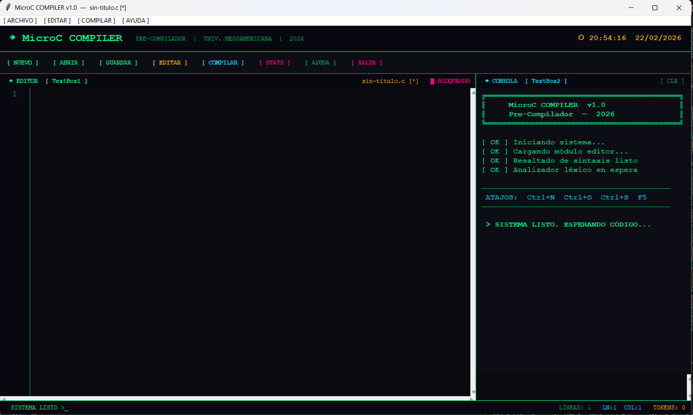

Compilador MicroC

Nombre: Andrea Gonzalez  
Carné: 202425508  
Curso: Autómatas y Lenguajes  
Proyecto: Pre-Compilador MicroC  
Catedrático: Ing. Baudilio Boteo  
Universidad Mesoamericana — 2026

--------------------------------------------------------------------------------------------------------------------------------------------------------------------------------------

¿De qué va esto?

Este proyecto es la primera parte del compilador MicroC que vamos construyendo en el curso. Por ahora lo que hice fue la interfaz gráfica completa con todas las funciones que se pidieron, más algunas cosas extra que fui agregando.

La idea es que funcione como un editor de código donde puedas abrir, escribir y guardar archivos ".c", y que la consola del lado derecho te muestre mensajes cuando compilás.

--------------------------------------------------------------------------------------------------------------------------------------------------------------------------------------

 Lo que tiene el programa

Lo básico que pedía la hoja:

- Podés escribir código nuevo con el botón Nuevo
- Abrís archivos ".c" y se cargan en modo solo lectura
- Para editarlos tenés que darle al botón Editar
- Guardás con el botón Guardar — si es nuevo te pide la ubicación, si ya existe lo sobreescribe
- La consola muestra los resultados y mensajes
- El título de la ventana muestra el nombre del archivo que tenés abierto
- El botón Salir pregunta si tenés cambios sin guardar antes de cerrar

Cosas extra que le agregué:

- Resaltado de sintaxis en tiempo real — se colorean las palabras clave, strings, comentarios y números mientras escribís
- Números de línea al lado del editor
- Un contador de tokens que se actualiza solo en la barra de abajo
- Un reloj arriba a la derecha
- Cuando abrís un archivo aparece con una animación de typing en vez de cargarse de golpe
- Con Ctrl+T podés ver estadísticas del código: cuántas líneas tenés, cuántos tokens, qué keywords usaste
- Al compilar con F5 te dice si hay advertencias o errores básicos
- Auto-indentación cuando presionás Enter dentro de llaves "{}"

--------------------------------------------------------------------------------------------------------------------------------------------------------------------------------------

Tecnologías

Usé Python con Tkinter para la interfaz. No tuve que instalar nada extra porque Tkinter ya viene incluido con Python, lo que me facilitó bastante las cosas.

--------------------------------------------------------------------------------------------------------------------------------------------------------------------------------------
Cómo ejecutarlo

git clone https://github.com/TuUsuario/Compilador-MicroC-AndreaGonzalez.git
cd Compilador-MicroC-AndreaGonzalez
python src/microc_compiler.py

 & C:\Users\sofia\AppData\Local\Programs\Python\Python314\python.exe c:/Users/sofia/Desktop/Compilador-MicroC-SofiaGonzalez/src/microc_compiler.py

El ".exe":

pip install pyinstaller
pyinstaller --onefile --windowed --name MicroCCompiler src/microc_compiler.py

--------------------------------------------------------------------------------------------------------------------------------------------------------------------------------------

## Capturas de pantalla

--------------------------------------------------------------------------------------------------------------------------------------------------------------------------------------

## Video

🔗 [Ver video demostrativo](#) ← acá va el enlace cuando lo grabe

--------------------------------------------------------------------------------------------------------------------------------------------------------------------------------------

## Cómo está organizado el repositorio

Compilador-MicroC-AndreaGonzalez/
├── src/
│   └── microc_compiler.py
├── assets/
├── docs/
│   └── manual_usuario.md
├── test/
│   └── prueba.c
└── README.md
