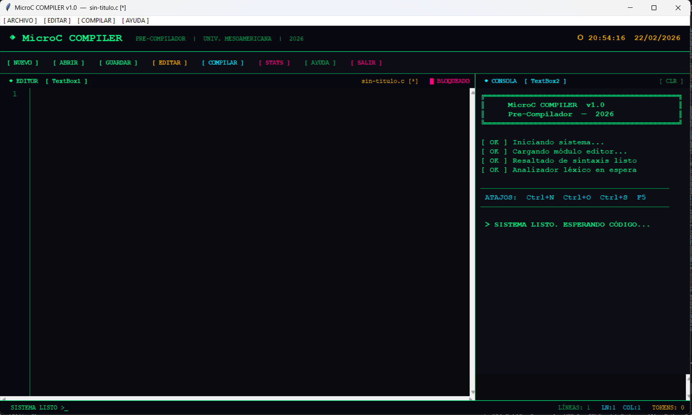
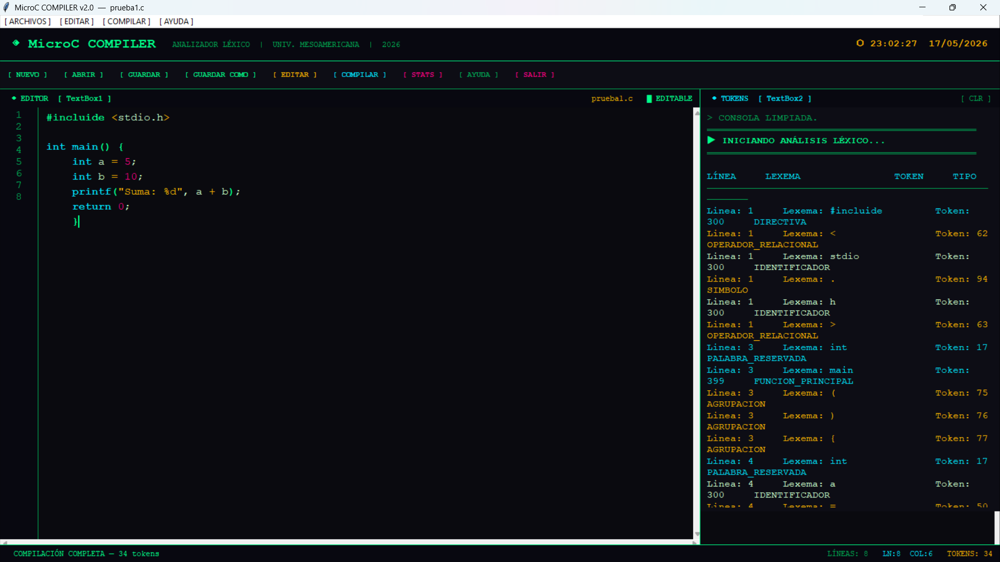
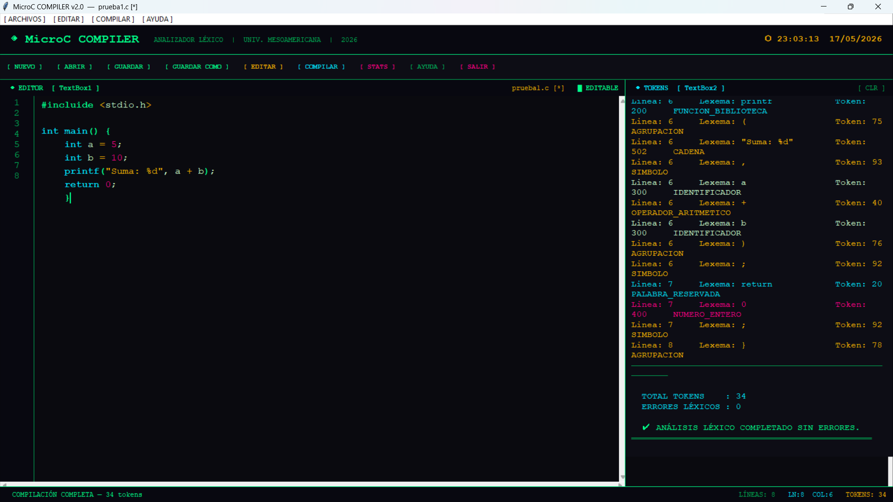
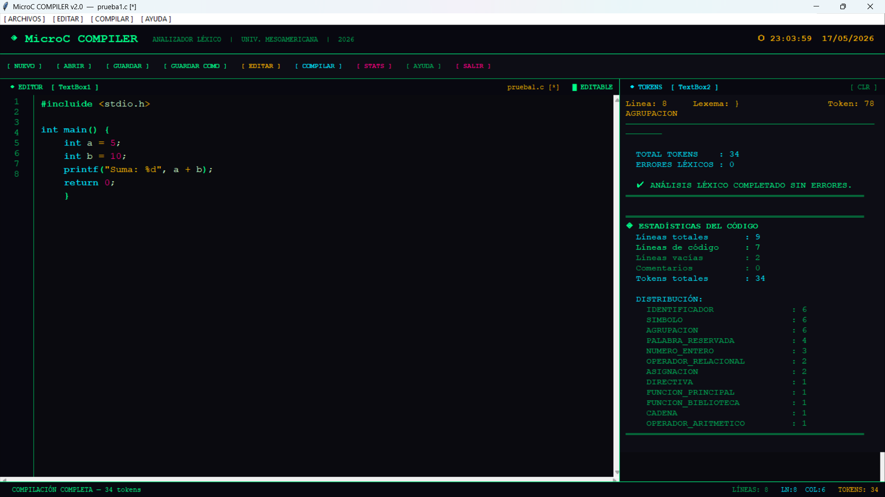
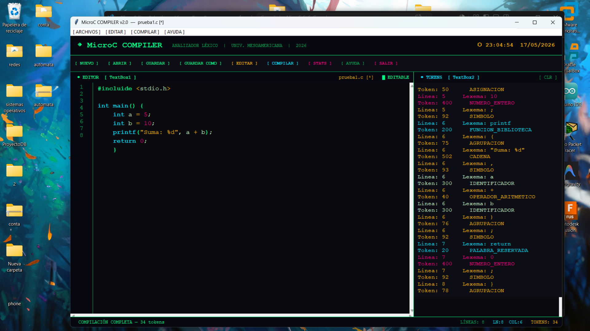

# Compilador MicroC

**Nombre:** Andrea Gonzalez  
**Carné:** 202425508  
**Curso:** Autómatas y Lenguajes  
**Proyecto:** Analizador Léxico MicroC  
**Catedrático:** Ing. Baudilio Boteo  
**Universidad Mesoamericana — 2026**

---

## ¿De qué va esto?

Este es el compilador MicroC que hemos ido construyendo en el curso. Esta segunda entrega ya tiene el analizador léxico completo, que es la primera etapa real de un compilador. Lo que hace es leer el código fuente carácter por carácter y clasificar cada cosa que encuentra: si es una palabra reservada, un número, un símbolo, un comentario o un identificador.

El programa tiene dos partes visuales: el editor a la izquierda donde escribís o abrís el código, y la consola a la derecha donde aparece la tabla de tokens cuando compilás.

---

## Clases implementadas

Según el diagrama UML que nos dieron en clase, el programa tiene 3 clases:

**frmEditor** — es la interfaz gráfica, tiene todos los botones y maneja lo que ve el usuario.

**UnidadesLexicas** — es la tabla de tokens. Tiene un diccionario con todas las palabras reservadas de C, las funciones de las bibliotecas (stdio, stdlib, string, math) y todos los símbolos del lenguaje. Tiene dos métodos: `GetTokenPalabra` que busca una palabra y retorna su token (si no la encuentra retorna 300, que significa identificador), y `GetTokenSimbolo` que hace lo mismo pero para símbolos (retorna -1 si no lo encuentra).

**AnalizadorLexico** — es el motor del análisis. Recorre el código carácter por carácter con un while y va decidiendo qué hacer con cada carácter usando ifs. Tiene los métodos `IdentificadorPalabraReservada`, `EnteroReal` y `AutomataComentario` que son los autómatas que se activan según el tipo de carácter que encuentre.

---

## Cómo funciona el análisis (el árbol de decisión)

Cuando le das a Compilar, el programa toma el texto del editor y lo recorre así:

- Si encuentra una letra o guión bajo → llama `IdentificadorPalabraReservada`
- Si encuentra un número → llama `EnteroReal`  
- Si encuentra `/` → llama `AutomataComentario` (puede ser `//` o `/* */`)
- Si encuentra un símbolo → busca en la tabla de `UnidadesLexicas`
- Si encuentra espacio, tab o salto de línea → lo salta
- Si no reconoce el carácter → lo marca como error léxico (token -1)

El resultado aparece en la consola con el formato:
```
Linea: 1    Lexema: int    Token: 17    PALABRA_RESERVADA
Linea: 1    Lexema: main   Token: 399   FUNCION_PRINCIPAL
Linea: 2    Lexema: (      Token: 75    AGRUPACION
```

---

## Lo que tiene el programa

Lo básico que pedía la hoja:

- Nuevo, Abrir, Guardar, Guardar Como, Editar, Compilar, Ayuda, Salir
- Análisis léxico real con tabla de tokens en la consola
- Identifica palabras reservadas, números enteros y reales, comentarios de línea y bloque, strings, caracteres, identificadores y símbolos
- Marca en rojo los errores léxicos (símbolos no reconocidos)

Cosas extra que tiene:

- Resaltado de sintaxis en tiempo real mientras escribís
- Numeración de líneas al lado del editor
- Contador de tokens en vivo en la barra de estado
- Reloj en tiempo real arriba a la derecha
- Animación de typing cuando abrís un archivo
- Estadísticas detalladas con Ctrl+T
- Auto-indentación al presionar Enter dentro de llaves
- Guardar Como separado del Guardar normal

---

## Tecnologías

Python con Tkinter. No instalé librerías extra porque Tkinter ya viene con Python.

---

## Cómo ejecutarlo

Necesitás Python 3.10 o más nuevo.

```bash
git clone https://github.com/agonz46/Compilador-MicroC-AndreaGonzalez.git
cd Compilador-MicroC-AndreaGonzalez
python src/microc_compiler.py
```

---

## Capturas de pantalla






---

## Videos

🔗 Pre-Compilador v1.0: https://docs.google.com/videos/d/1bQ2itUNfG70XEA_CDtziJY6sB7LPmkN_mMyYtSGPjrY/edit?usp=sharing

🔗 Analizador Léxico v2.0: https://docs.google.com/videos/d/1qdp8D3H9gQFlDvEh4VQNbqYMSUZopSr-Szs5kzbMapM/edit?usp=sharing, https://docs.google.com/videos/d/1q2K6bboHoPHOuN7l3AKM91zbKcD7KgdV6g6UVIHx__0/edit?usp=sharing

---

## Estructura del repositorio

```
Compilador-MicroC-AndreaGonzalez/
├── src/
│   └── microc_compiler.py   ← código principal v2.0
├── assets/
│   └── pantalla.png ... pantalla9.png
├── docs/
│   └── manual_usuario.md
├── test/
│   ├── prueba1.c
│   └── prueba2.c
└── README.md
```